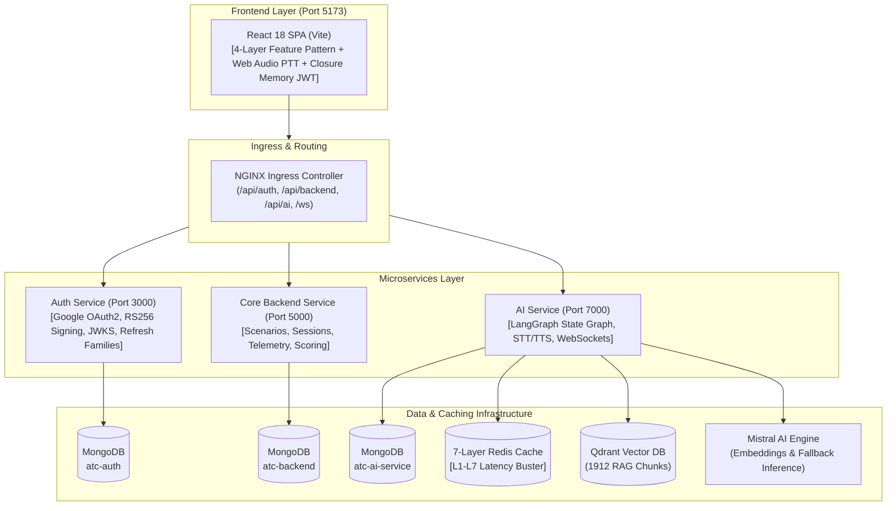

# ✈️ Enterprise Voice Agent & Microservice Architecture Skill

This skill documents the production-proven architecture, design patterns, and engineering best practices of the **ATC Voice Simulator Platform**. Use this runbook as an authoritative reference when architecting or extending voice-driven AI platforms, distributed microservices, zero-trust authentication systems, or real-time web applications.

---

## 🏛️ Core Architectural Pillars



---

## 📑 In-Depth Architectural References

| Domain | Reference Guide | Key Highlights |
|---|---|---|
| 🏛️ **Microservices Monorepo** | [01-microservice-monorepo-pattern.md](./references/01-microservice-monorepo-pattern.md) | `server.js` vs `app/app.js` separation, database isolation, K8s probes (`/healthz`, `/readyz`), Skaffold sync. |
| 🛡️ **Zero-Trust Auth & JWKS** | [02-zero-trust-jwks-auth.md](./references/02-zero-trust-jwks-auth.md) | RS256 asymmetric signing, stateless JWKS key caching with rotation, rotating refresh families, closure memory JWTs. |
| ⚡ **7-Layer Redis Caching** | [03-redis-7-layer-caching.md](./references/03-redis-7-layer-caching.md) | Sub-300ms voice pipeline, L1-L7 cache matrix, template fast-pathing (~0ms LLM), SHA-256 base64 TTS caching. |
| 🧠 **LangGraph Voice State Graph** | [04-langgraph-voice-state-machine.md](./references/04-langgraph-voice-state-machine.md) | Half-duplex PTT turn orchestration, `interruptBefore: ['awaitReadback']`, fuzzy slot matcher, debrief node. |
| 🎨 **Frontend 4-Layer Architecture** | [05-frontend-4layer-architecture.md](./references/05-frontend-4layer-architecture.md) | Components → Custom Hooks → Services → Sync Redux Slices; Silent 401 refresh queue; Web Audio API PTT. |
| 📚 **Vector RAG Pipeline** | [06-rag-vector-pipeline.md](./references/06-rag-vector-pipeline.md) | 1,912 Qdrant chunks (FAA JO 7110.65 & ICAO Doc 4444), batch embedding with 429 retry backoff, cosine grounding. |

---

## ⚡ The 7-Layer Redis Latency Matrix

The breakthrough pattern of this platform is reducing AI voice turn latency from **~2,600ms down to <280ms**:

```
[STT Transcription] ~250ms ➔ [L1/L2 Redis RAG] ~5ms ➔ [Template Engine (0ms LLM)] ~0ms ➔ [L7 Redis TTS] ~5ms
=============================================================================================================
OPTIMIZED REDIS PLATFORM LATENCY = <280ms (REAL-TIME VOICE EMULATION)
```

| Layer | Key Pattern | Data Structure | TTL | Hit Latency | Role |
|---|---|---|---|---|---|
| **L1: Template Embeddings** | `emb:tmpl:{templateId}` | String (JSON) | 30 Days | `~2ms` | Caches 1024-dim `mistral-embed` vectors for step prompts. |
| **L2: Qdrant Grounding** | `gnd:tmpl:{templateId}` | String (JSON) | 7 Days | `~3ms` | Caches top-k ICAO/FAA phraseology excerpts per template. |
| **L3: State Checkpoint** | `sess:cp:{sessionId}` | String (JSON) | 24 Hours | `~4ms` | Serializes LangGraph `AgentState` for instant PTT resume (<5ms). |
| **L4: Dynamic Session Slots** | `sess:slots:{sessionId}` | Hash / String Map | 24 Hours | `~2ms` | Stores session-randomized variables (wind, squawk, altimeter). |
| **L5: JWKS Public Key Cache** | `auth:jwks:cache` | String (JSON) | 24 Hours | `~1ms` | Caches Auth RSA public keys for zero-latency local JWT verification. |
| **L6: Rate Limiter Counter** | `rl:ip:{ipAddress}` | Int Counter | 15 Mins | `~1ms` | Sliding window rate limiter protecting against LLM credit abuse. |
| **L7: TTS Audio Output Cache** | `tts:{sha256(text)}` | String (Base64 MP3) | 7 Days | `~5ms` | Caches audio base64 for static controller transmissions (650ms → 5ms). |

---

## 🧩 Gold Standard Code Patterns & Examples

Direct copy-pasteable reference implementations are located in the [examples/](./examples/) directory:

- 🚀 **Server Bootstrap:** [`examples/server-app-bootstrap.js`](./examples/server-app-bootstrap.js) — Clean separation of process entry point vs Express app factory.
- 🛡️ **Stateless JWKS Middleware:** [`examples/identifyUser-jwks-middleware.js`](./examples/identifyUser-jwks-middleware.js) — RS256 token verification with 24h key cache and zero-downtime key rotation fallback.
- 🔄 **Refresh Token Rotation:** [`examples/auth-controller-rotation.js`](./examples/auth-controller-rotation.js) — Single-use refresh token rotation with family revocation upon replay attack.
- 🧠 **LangGraph State Graph:** [`examples/langgraph-compiled-graph.js`](./examples/langgraph-compiled-graph.js) — Stateful turn machine with interrupt boundaries and additive transcript reducers.
- 🔒 **Axios 401 Refresh Queue:** [`examples/apiClient-401-refresh.js`](./examples/apiClient-401-refresh.js) — Closure memory token management and transparent request pausing during token renewal.
- 🎨 **4-Layer Feature Pattern:** [`examples/frontend-4layer-feature-pattern.jsx`](./examples/frontend-4layer-feature-pattern.jsx) — Complete implementation of Component → Hook → API Service → Redux Slice.

---

## 🚦 Architectural Rules & Invariants

When implementing or reviewing code against this architecture, enforce these strict rules:

### 1. Backend Microservice Invariants
- ❌ **No Cross-Database Queries:** Microservices never connect to or query another service's MongoDB database.
- ❌ **No Logic in `server.js`:** `server.js` contains **only** `dotenv.config()`, database connection, and `app.listen()`.
- ❌ **No `app.listen()` in `app/app.js`:** `app/app.js` creates and exports the Express app instance.
- ✅ **Standard Response Envelope:** All JSON responses return `{ status: 'success', data: ... }` or `{ status: 'error', message: ... }`.
- ✅ **Probes:** Every service must provide `/healthz` (liveness) and `/readyz` (readiness) returning HTTP 200.

### 2. Security & Identity Invariants
- ❌ **No Private Keys in Downstream Services:** Only `Auth` has access to `private.pem`. `Backend` and `Ai-service` verify tokens using `/.well-known/jwks.json`.
- ❌ **No LocalStorage for JWTs:** Access tokens are stored in JavaScript module closure memory.
- ✅ **Opaque Refresh Cookies:** Refresh tokens are stored in `HttpOnly`, `SameSite=Lax` cookies scoped to `/api/auth/refresh`.
- ✅ **Replay Detection:** Presentation of a previously rotated refresh token immediately deletes the entire token `familyId`.

### 3. Voice Agent & AI Invariants
- ✅ **Interrupt Boundaries for Voice Turns:** Stateful half-duplex voice interactions use `interruptBefore: ['awaitReadback']`.
- ✅ **Fast-Path Before LLM:** If a turn has a predefined template and resolved slots, render directly in memory (~0ms) before falling back to LLM completion.
- ✅ **Deterministic TTS Hashing:** Cache static controller speech payloads using SHA-256 hashes in Redis L7.

### 4. Frontend Invariants
- ❌ **No Direct API Calls in Components:** Components **never** call `axios` or `fetch`.
- ❌ **No Async Thunks in Slices:** Redux slices contain **only** synchronous reducers. Async orchestration belongs exclusively in custom hooks (`Hooks/[feature].hooks.js`).
- ❌ **No Hardcoded Colors:** Components must use CSS Custom Properties / design system tokens (`var(--bg-primary)`).

---

## 🧪 Verification & Diagnostic Commands

```bash
# Verify Redis 7-Layer Cache Health & Keys
redis-cli info stats
redis-cli keys "emb:tmpl:*"
redis-cli keys "gnd:tmpl:*"
redis-cli keys "sess:cp:*"
redis-cli keys "tts:*"

# Ingest & Verify 1,912 Chunk Qdrant Vector RAG
python3 helpers/extract_pdf_text.py
npm --prefix Ai-service run ingest-rag
npm --prefix Ai-service run verify-rag

# Start Local Multi-Service Environment via Skaffold
skaffold dev
```
